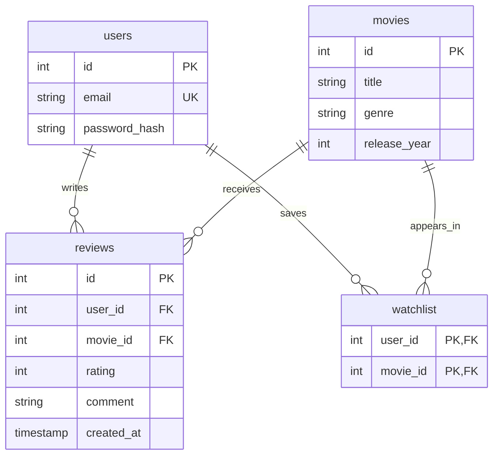

# FilmRecension ER diagram

```mermaid
erDiagram
    users ||--o{ reviews : writes
    movies ||--o{ reviews : receives
    users ||--o{ watchlist : saves
    movies ||--o{ watchlist : appears_in

    users {
        int id PK
        string email UK
        string password_hash
    }

    movies {
        int id PK
        string title
        string genre
        int release_year
    }

    reviews {
        int id PK
        int user_id FK
        int movie_id FK
        int rating
        string comment
        timestamp created_at
    }

    watchlist {
        int user_id PK, FK
        int movie_id PK, FK
    }
```

Each user can review a movie once. The watchlist uses `(user_id, movie_id)` as
its primary key, so a movie can appear only once for a given user.
